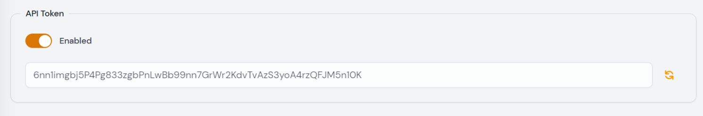

# Larvis

Larvis is a laravel package to push site monitoring data to Larastats. If you want to send exception data to Larastats you must install Larvis in your application and share an api token from Larastats.

You can generate api tokens when you create or edit a site:

You can check [Larvis documentation on Github](https://github.com/taecontrol/larvis).