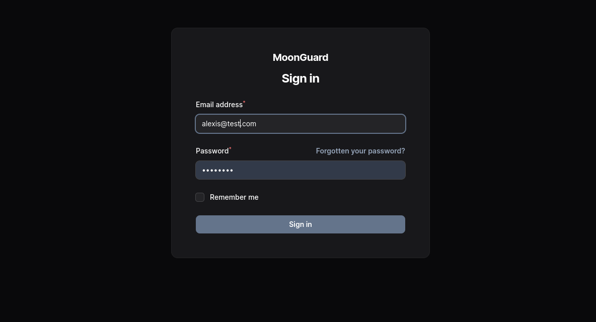
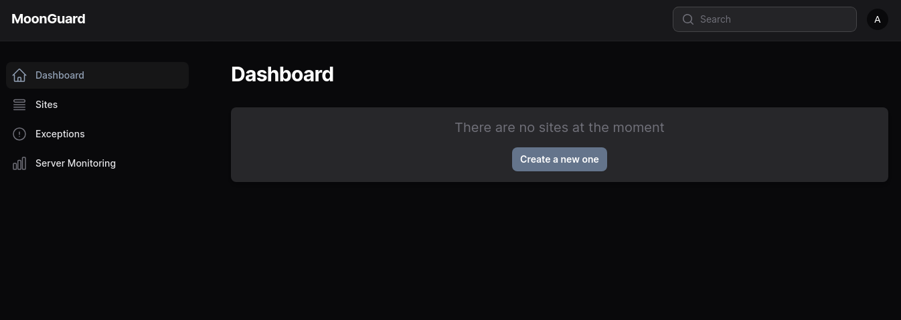

# Installation

## Requirements

Before using MoonGuard, make sure you have the following installed:

- Laravel Framework 10+
- Filament 3.0+
- Composer
- Node.js (Version 18+)

Filament is necessary to use MoonGuard in your project, you can install Filament
by following the official documentation [here](https://filamentphp.com/docs/3.x/panels/installation).


Once you setup your Laravel project with filament, you can install MoonGuard
plugin via composer

```bash
composer require taecontrol/moonguard
```

Publish the MoonGuard assets files and migrations file in your project.

:::caution Heads Up
If you have already published Moonguard Migrations before its release, please
refer to the migration [documentation](./migrations) for any updates.
:::

```bash
php artisan vendor:publish --tag="moonguard-assets"

php artisan vendor:publish --tag="moonguard-migrations"
```

In production, run the migrations:

```bash
php artisan migrate
```

Go to `/moonguard` route to check the MoonGuard admin panel page:



If you don’t have any user, you can create a filament user to access to MoonGuard
admin panel:

```bash
php artisan make:filament-user
```

 Login and you will land in the dashboard



## Moonguard Command Scheduler

The **MoonGuard Command Scheduler** is a helper utility that executes all the
Moonguard commands related to checks:

- CheckUptimeCommand.
- CheckSslCertificateCommand.
- DeleteOldExceptionCommand.
- DeleteServerMetricCommand.

You can use this utility to set up MoonGuard task scheduling faster.

To utilize this utility, first define a new schedule in your app. Then, within
the `schedule()` method of `app/Console/Kernel.php`, call the static function
`scheduleMoonGuardCommands()` from the `MoonguardCommandScheduler` class. Pass the
`$schedule` object and three cron strings to this function. These strings
correspond to the Uptime Check, the SSL Certificate Check, and optionally, the
deletion of old Exceptions.

```php
<?php

use Taecontrol\MoonGuard\Console\MoonGuardCommandsScheduler;
//...

protected function schedule(Schedule $schedule): void
{
  MoonGuardCommandsScheduler::scheduleMoonGuardCommands(
    $schedule,
    '* * * * *', // <-- Uptime Check Cron
    '* * * * *', //<-- SSL Certificate Cron
    '0 0 * * *', //<-- [Optional] Delete Exceptions Cron
    '0 0 * * *' //<-- [Optional] Delete Server Metrics
  );
}
```

The `MoonGuardCommandsScheduler` is scheduled by running `php artisan schedule:run`.

Using the `MoonGuardCommandsScheduler` is not a requirement. If you prefer to program
the commands individually, we recommend that you refer to the [commands section](./commands.md)

