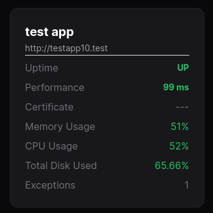
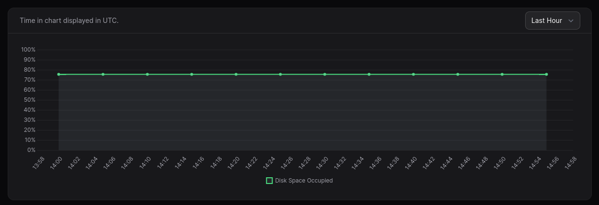
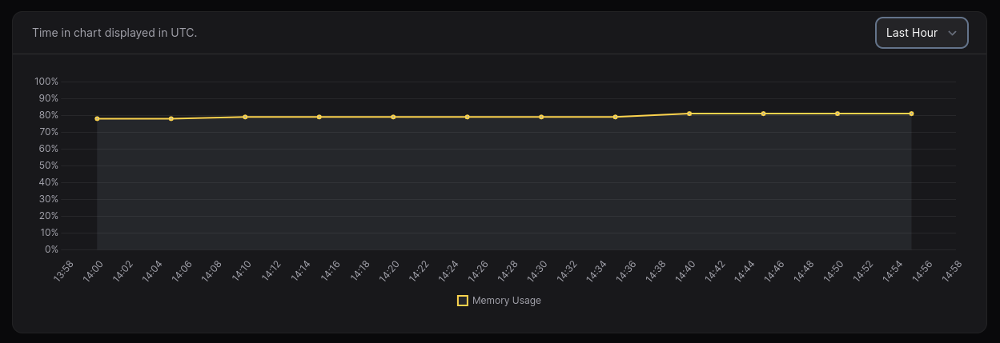
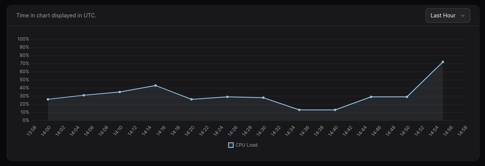
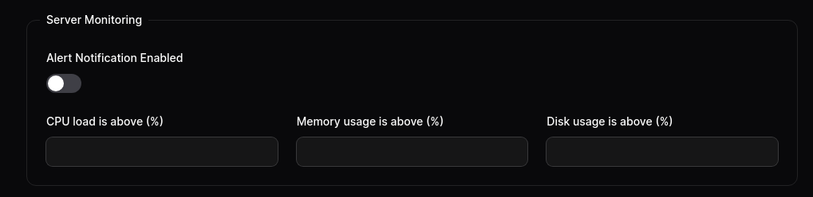

MoonGuard provides a server monitoring feature that allows you to track
hardware variables of your server. It works with the `CheckHardwareHealthCommand`
from [Larvis](https://github.com/taecontrol/larvis/tree/1.alpha?tab=readme-ov-file#commands)
to monitor the CPU load, memory, and total disk usage.

## Scheduling CheckHardwareHealth command

You can use the `CheckHardwareHealthCommand` periodically by scheduling it in the
Laravel project that uses Larvis. It sends the CPU average load of the last 5
minutes, memory usage, and total disk space used by the server where your
application is installed. Like other commands, you can schedule it using
Laravel's command scheduler.

```php
<?php

namespace App\Console;

use Illuminate\Console\Scheduling\Schedule;
use Illuminate\Foundation\Console\Kernel as ConsoleKernel;
use Taecontrol\Larvis\Commands\CheckHardwareHealthCommand;

class Kernel extends ConsoleKernel
{
    /**
   * Define the application's command schedule.
   *
   * @param  \Illuminate\Console\Scheduling\Schedule  $schedule
   * @return void
   */
  protected function schedule(Schedule $schedule)
  {
      $schedule->command(CheckHardwareHealthCommand::class)->daily();
  }
}
```

After setting up your Laravel site with Larvis, you can check the tracked variables in your
MoonGuard Dashboard.



In the system monitoring section, you will see a historical data graph of the
hardware usage for each application that uses Larvis. You can set it up to display
data from the last hour, day, or week.







## Notifications

In MoonGuard, we can set optional percentage limits for server metric
indicators' usage and consumption.




If any metric indicator exceeds the limit, it can send a notification via Slack.
Make sure you have set up your Slack notification; you can learn more about it in
the [notification docs](./notifications/notifications-slack.md)

## Delete Server Monitoring record

By default, MoonGuard will delete Server Monitoring records that are older than
7 days. If you want to disable or change this feature, go to the `config/moonguard.php`
file and make the desired changes.

```php
<?php

'prune_server_monitoring' => [
    /*
     * Enables or disables pruning server monitoring data.
     */
    'enabled' => true,

    /*
     * Deletes server monitoring logs that are older than 7 days..
     */
    'prune_server_monitoring_records_older_than_days' => 7,
],
```

If you want to delete the record data manually, you can use the `server-metric` command
in your MoonGuard app:

```bash
php artisan server-metric:delete
```

