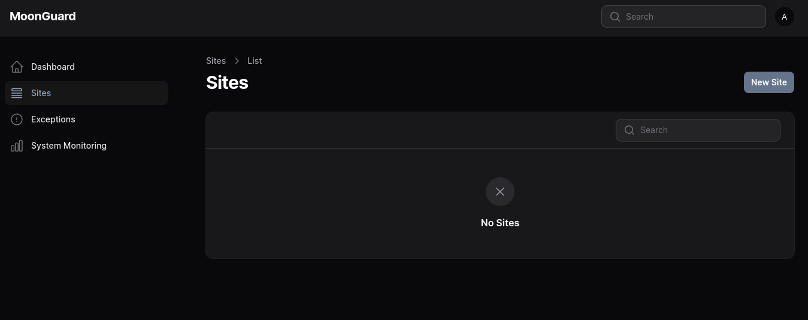
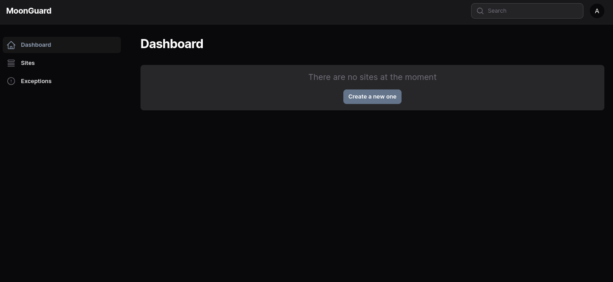
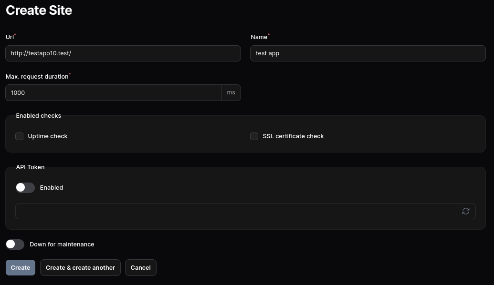
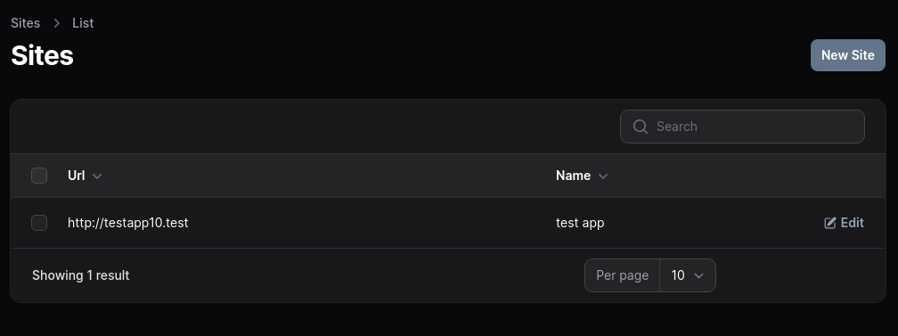
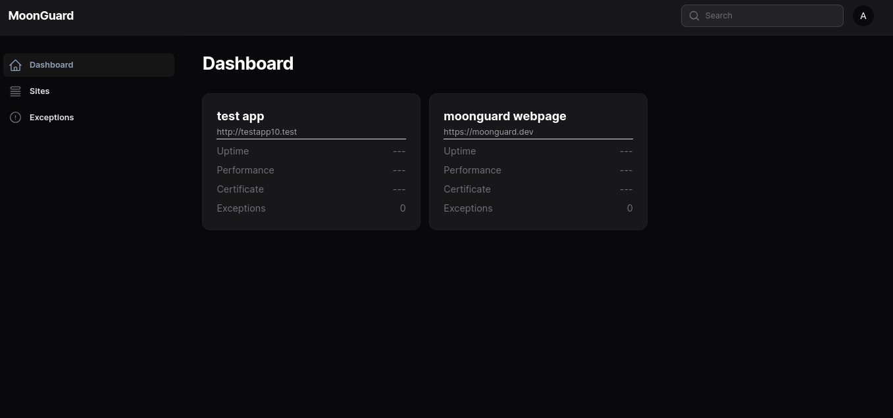

# Site

A “**site**" refers to the representation of production apps, websites, or
platforms that you wish to monitor using MoonGuard. It serves as the central
entity within MoonGuard, with all functionalities and components being associated
with a specific site.

The **Sites** view allows you to create, edit, and delete sites within MoonGuard.
To create a new site, you can locate the **New Site** button located at the top
right corner of the interface. If it is your first time setting up MoonGuard,
the site list will be empty as there are no existing records.

You can also create a site from dashboard if there’s no site created.

MoonGuard requires the next parameters to be filled in order to create a new site:

- **Url**: web address of the application.
- **Name**: name to display.
- **Max. request duration**: maximum time for request in ms for **Uptime Check**.
- **Enabled checks**:
    - **Uptime check**: service to check the site uptime.
    - **SSL Certificate check**: service to check the site SSL certificate status.
- **API Token**: unique token to link the site using Larvis, for catching exceptions
(make sure that [Larvis 1.0.0](https://github.com/taecontrol/larvis/tree/1.x) is
configured to use the token).
- **Down for maintenance**: bypass all site checks if the site is in maintenance.

After creating multiple sites, they will be displayed in the list on the main
**Sites** view. Clicking on a site will open the edit view, where you can make
changes to the site. Additionally, you have the option to delete the site from
the edit view.

In the dashboard, you can also also see the general status for your sites.

:::caution Heads Up
If you **delete** a site any data related to the site will be deleted as well.
:::

