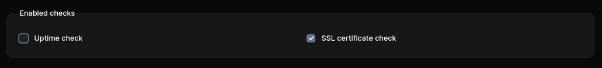
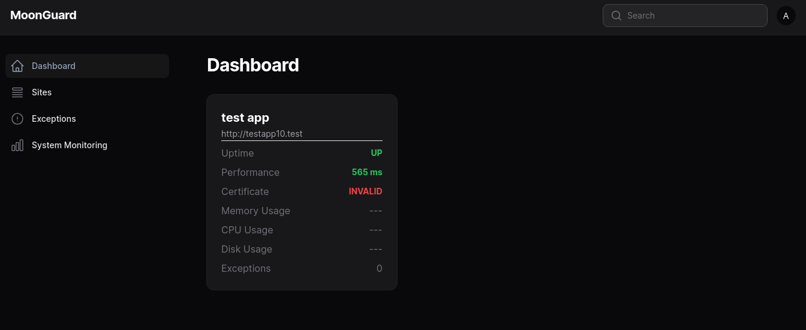

# SSL Certificate

MoonGuard is also capable of checking the status of SSL certificates for your
sites. This feature will notify you if a certificate is about to expire, is
invalid, or does not exist.

To check the SSL certificate for your site, navigate to the site's edit page or
create page and enable the SSL certificate check button.



:::caution Heads Up
Please ensure that your site is not in maintenance mode, as this will prevent
the execution of the SSL Certificate check.
:::

The SSL certificate status can be viewed in your dashboard.



Other behaviors of the SSL certificate can be modified in the configuration file.

```php
<?php
[
  'ssl_certificate_check' => [
    /*
     * Enable or disable ssl certificate checks globally.
     */
    'enabled' => true,

    /*
     * The ssl certificate check model to use.
     */
    'model' => \Taecontrol\MoonGuard\Models\SslCertificateCheck::class,

    /*
     * The number of days before a certificate expires to send a notification.
     */
    'notify_expiring_soon_if_certificate_expires_within_days' => 7,
  ],
]
```
:::caution Heads Up
If you have a site in maintenance mode and had previously done an
ssl-certificate check without this mode, the status card will show that
previous check.
:::
