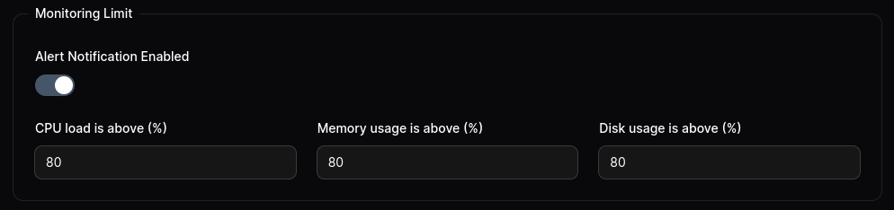

MoonGuard, provides with a hardware health Monitoring system that allow to track
hardware variables of your serve, it works with the `CheckHardwareHealthCommand`
from [Larvis](https://github.com/taecontrol/larvis/tree/1.alpha?tab=readme-ov-file#commands)
to monitor the CPU Load, Memory and total disk usage.

## Scheduling CheckHardwareHealth command

You can use `CheckHardwareHealthCommand` periodically by scheduling in the Laravel
project that use Larvis. It send the CPU average load of 5 minutes before,
the memory usage and the total disk used of the server where is installed your
application. Like other commands, you can schedule it using Laravel's command
Scheduler.

```php
<?php

namespace App\Console;

use Illuminate\Console\Scheduling\Schedule;
use Illuminate\Foundation\Console\Kernel as ConsoleKernel;
use Taecontrol\Larvis\Commands\CheckHardwareHealthCommand;

class Kernel extends ConsoleKernel
{
    /**
   * Define the application's command schedule.
   *
   * @param  \Illuminate\Console\Scheduling\Schedule  $schedule
   * @return void
   */
  protected function schedule(Schedule $schedule)
  {
      $schedule->command(CheckHardwareHealthCommand::class)->daily();
  }
}
```

Once you have setup your Larvis project you can check in your MoonGuard Dashboard
the track variables.


You can also check your hardware health in the system monitoring sidebar


## Notifications

You can setup a monitoring limit notification for each site in MoonGuard, for use
it, you can setting on the settings of the Site and add the limit that you want.




Once you setup your limit, you will get a notification via slack if the value pass
the limit. Make shore you have setting up your notification via slack, you can see
more about it in the [notification docs](./notifications/notifications-slack.md)


## Delete System monitoring record

MoonGuard by default will delete the system monitoring record older than 5 days,
if you want disable or change this feature go to the `config/moonguard.php` file
and change as you want.

```php
<?php

'system_monitoring_records_deletion' => [
  /*
   * enables or disables the deletion of monitoring logs.
   */
  'enabled' => true,

  /*
   * The age in days of the system monitoring records to delete.
   */
  'delete_system_monitoring_records_older_than_days' => 5,
],
```

If you want to delete the record data manually, you can use the `system-metric` command
in your MoonGuard app:

```bash
php artisan system-metric:delete
```

