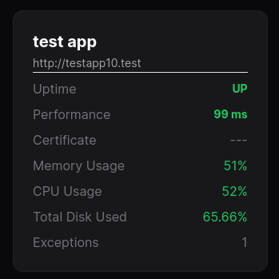
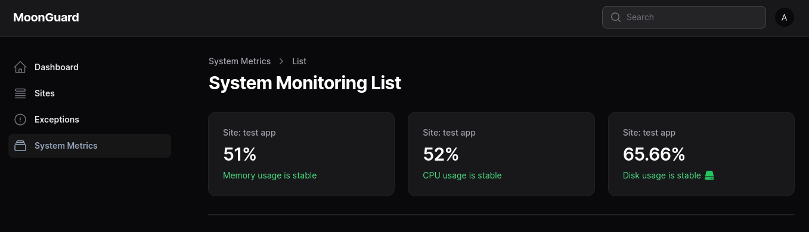

MoonGuard, provides with a hardware health Monitoring system that allow to track
hardware variables of your serve, it works with the `CheckHardwareHealthCommand`
from [Larvis](https://github.com/taecontrol/larvis/tree/1.alpha?tab=readme-ov-file#commands)
to monitor the CPU Load, Memory and total disk usage.

## Scheduling CheckHardwareHealth command

You can use `CheckHardwareHealthCommand` periodically by scheduling in the Laravel
project that use Larvis. It send the CPU average load of 5 minutes before,
the memory usage and the total disk used of the server where is installed your
application. Like other commands, you can schedule it using Laravel's command
Scheduler.

```php
<?php

namespace App\Console;

use Illuminate\Console\Scheduling\Schedule;
use Illuminate\Foundation\Console\Kernel as ConsoleKernel;
use Taecontrol\Larvis\Commands\CheckHardwareHealthCommand;

class Kernel extends ConsoleKernel
{
    /**
   * Define the application's command schedule.
   *
   * @param  \Illuminate\Console\Scheduling\Schedule  $schedule
   * @return void
   */
  protected function schedule(Schedule $schedule)
  {
      $schedule->command(CheckHardwareHealthCommand::class)->daily();
  }
}
```

Once you have setup your Larvis project you can check in your MoonGuard Dashboard
the track variables.



You can also check your hardware health in the system monitoring sidebar



## Delete Hardware Data

If you want to delete the hardware data you can use the `system-metric` command
in your MoonGuard app:

```bash
php artisan system-metric:delete
```

