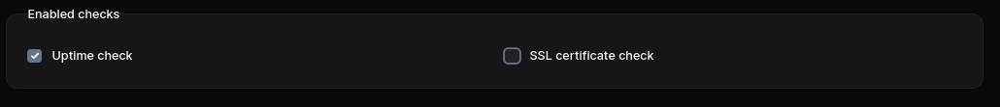
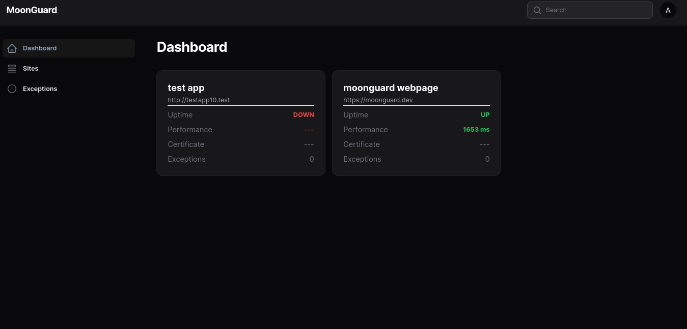

# Uptime

The uptime check feature allows you to determine whether their site is currently
online or not. If the site goes down, notifications can be sent via email or
Slack. For more details on notifications, please refer to the
[notification section](../notifications/notifications.md).

You can set up the Uptime check either when creating a new site or when editing
an existing one in the `enable checks` section.



:::caution Heads Up
Please ensure that your site is not in maintenance mode, as this will prevent
the Uptime check from monitoring its uptime.
:::

Afterwards, you view the uptime information in the Dashboard panel. If the site
is down, the uptime check will fail and show a **DOWN**.



You can also modify other behaviors in the MoonGuard config file.

```php
'uptime_check' => [
  /*
   * Enable or disable uptime checks globally.
   */
  'enabled' => true,

  /*
   * The uptime check model to use.
   */
  'model' => \Taecontrol\MoonGuard\Models\UptimeCheck::class,

  /*
   * The number of consecutive failures before a notification should be sent.
   */
  'notify_failed_check_after_consecutive_failures' => 1,

  /*
   * How often a notification is resent after the uptime check fails
  */
  'resend_uptime_check_failed_notification_every_minutes' => 5,
],
```
:::caution Heads Up
If you have a site in maintenance mode and had previously done an uptime check
without this mode, the status card will show that previous uptime.
:::
