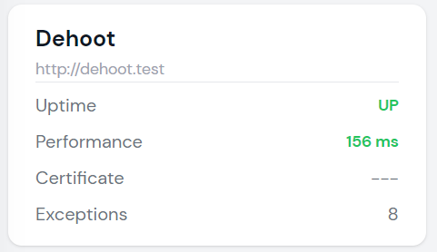
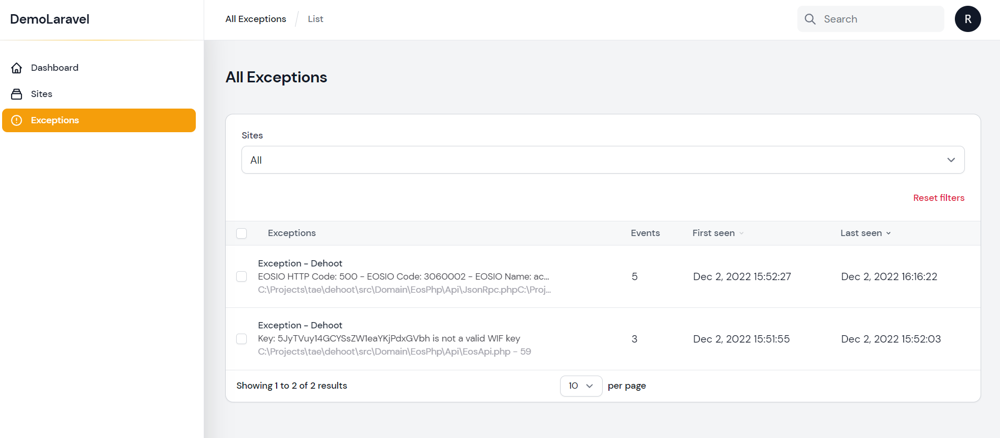
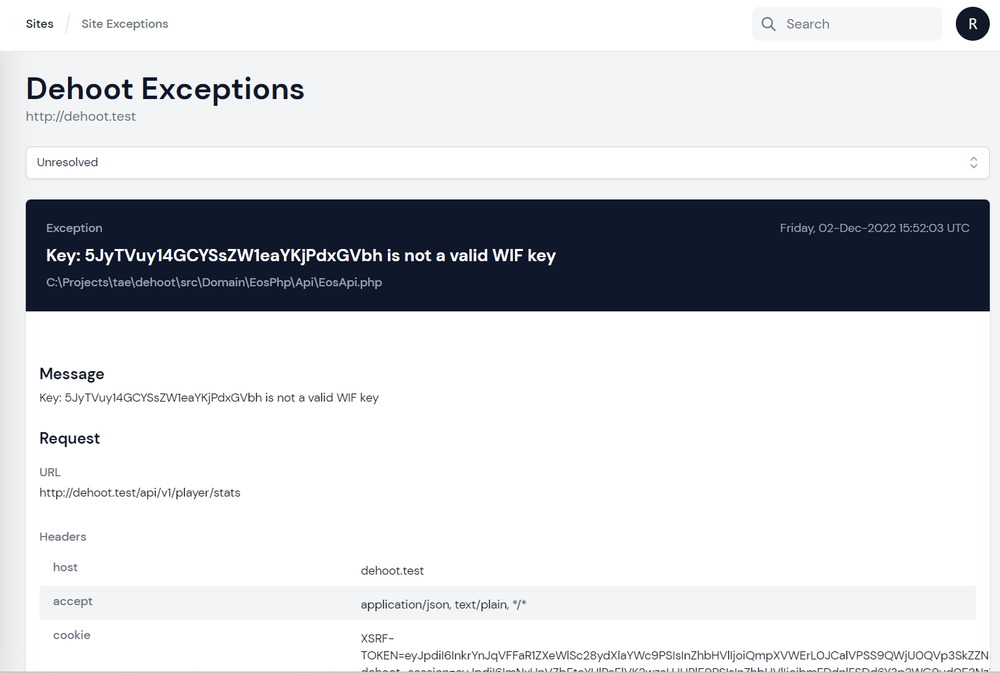

# Exceptions

MoonGuard allows users to review their site's exceptions using Larvis, a package
designed to handle exceptions and send them to the MoonGuard admin panel. Before
checking your site's exceptions, please ensure that Larvis has been installed
(refer to the [Larvis documentation](../larvis.md)) and that your **API Token** has
been added to the .env file of your site project.

```php
//example
MOONGUARD_SITE_API_TOKEN=M5YY1QqLMEVOwGlnGeafHIatEtb5V1NUSZ1PUnGRSQFmBcwr96XoANFINNYO
MOONGUARD_DOMAIN=https://moonguard.test
```
After installing Larvis, the number of exceptions for a site can be viewed in
the status card on the dashboard.



Additionally, all exceptions can be found on the Exception view:



On the Exception view, users can view all exceptions in a group, including the
first and last reported times. To view the details of a specific exception,
simply click on the corresponding row.



On this view, users can resolve, ignore, review, or mark exceptions as unresolved.

The behavior of the exception log can also be modified in the MoonGuard config file.

```php
'exceptions' => [
        'enabled' => true,
        'notify_time_between_group_updates_in_minutes' => 15,
        'exception_log' => [
            'model' => \Taecontrol\MoonGuard\Models\ExceptionLog::class,
        ],
        'exception_log_group' => [
            'model' => \Taecontrol\MoonGuard\Models\ExceptionLogGroup::class,
        ],
    ],
```
