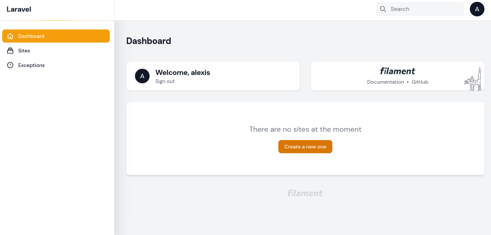

# Installation

## Requirements
Before using MoonGuard, make sure you have the following installed:
- Laravel Framework 9.0
- Filament 2.0
- Composer
- Node.js (Version 16+)

MoonGuard must be installed in a Laravel project using Composer.
Once you have created your Laravel project and setup with [Filament](https://filamentphp.com/docs/2.x/admin/installation)
you can install MoonGuard via composer:

```bash
composer require taecontrol/moonguard:0.1.0
```

Then you need publish the moonguard migrations:

```bash
php artisan vendor:publish --tag="moonguard-migrations"
```

finally run the migrations:

```bash
php artisan migrate
```
In the `/admin` route you will see the moonguard installed.


