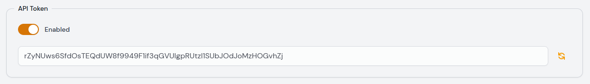

# Larvis Package

Larvis is a PHP package for Laravel that allows a Laravel app to send
exceptions information to Moonguard.

:::caution Heads Up
Important: This version only works with MoonGuard v0.1.0.
:::

## Installation

You can install Larvis via composer using the following command:

```bash
composer require taecontrol/larvis
```

That’s it, no additional steps needed.

## Larvis Configuration:

To allow Larvis to capture and report exceptions, it is necessary to add the
following code to the `app/Exceptions/Handler.php` file:

```php
use Taecontrol\Larvis\Larvis;

/**
* Register the exception handling callbacks for the application.
*
* @return void
*/
public function register()
{
  if (! app()->environment('testing')) {
    $this->reportable(function (Throwable $e) {
      /** @var Larvis $larvis */
      $larvis = app(Larvis::class);

      $larvis->captureException($e);
    });
  }
```

Exception capture and sending won’t work if your project's `APP_ENV` is set to
`testing`. Ideally, you want this report to be done when the environment is
productive with `APP_ENV=production`.

To setup the site api token and the MoonGuard domain add two new variables to
the application's `.env` file:

```php
MOONGUARD_DOMAIN=https://mymoonguard.com
MOONGUARD_SITE_API_TOKEN=rZyNUws6SfdOsTEQdUW8f9949F1if3qGVUIgpRUtzI1SUbJOdJoMzHOGvhZj
```

You can obtain the API token at the MoonGuard admin panel (Site administration).
This token is unique to your site and is used to authenticate the site in every
request to MoonGuard.




