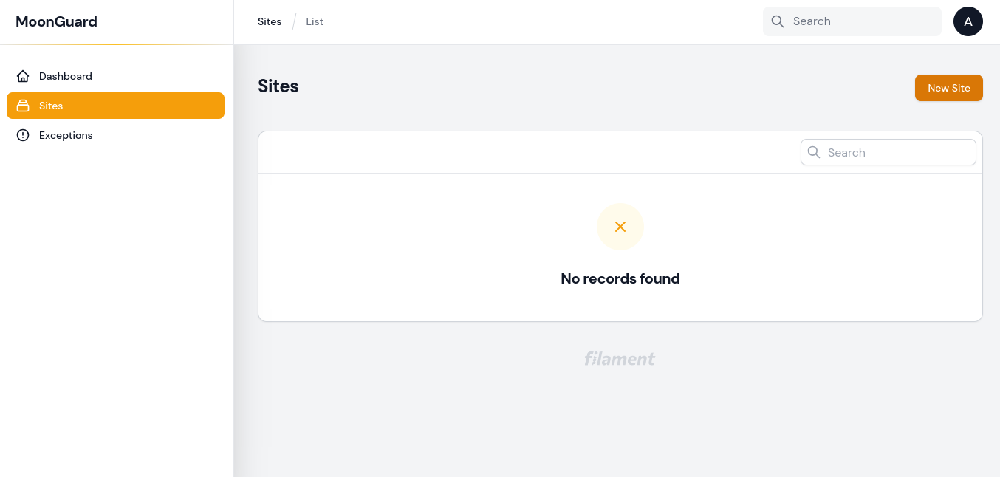
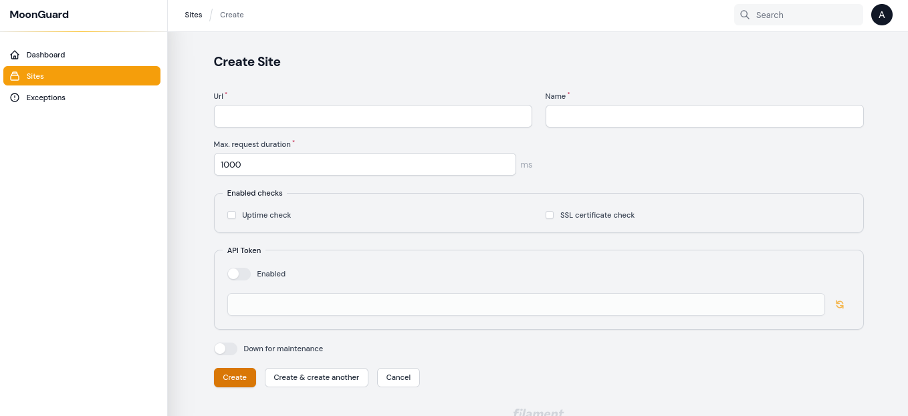
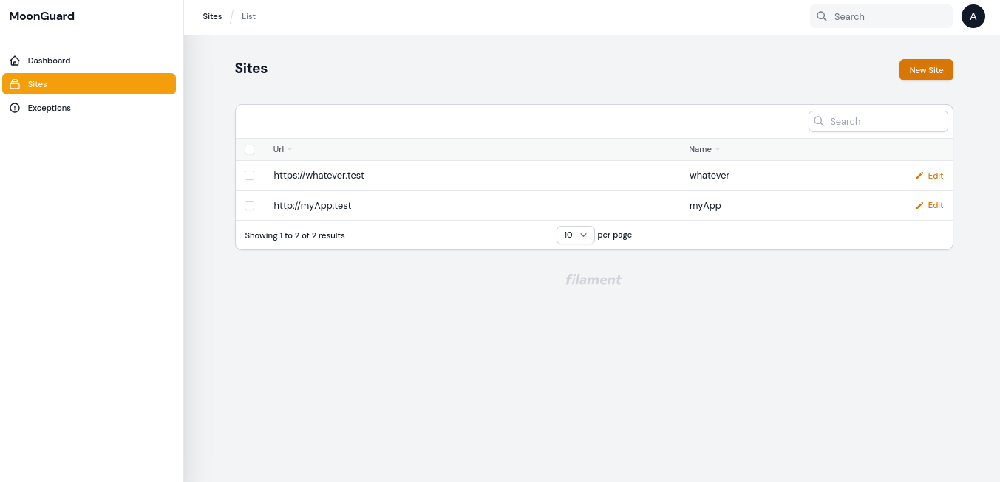
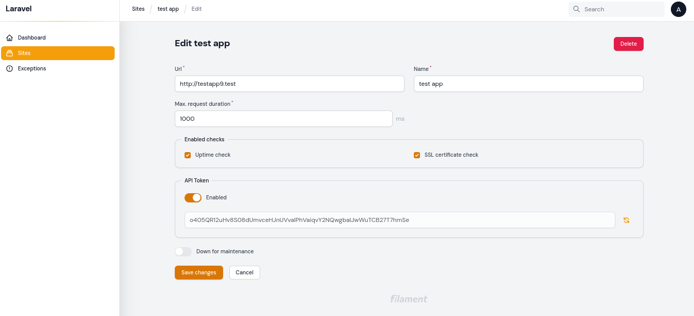
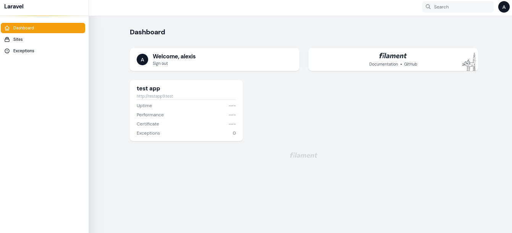

# Site

A "**site**" is the representation of your production apps, websites, or
platforms that you want to monitor using MoonGuard. It is the main entity of
MoonGuard, and everything is related to a site.

Go to the **Sites** view in the sidebar. In this view is possible to create, edit
and delete sites from MoonGuard, in order to create a site there’s a
**New Site** button available at the top right corner. If it’s the first time
setting up MoonGuard probably there won’t be any records of sites on the list.

MoonGuard requires the next parameters to be filled in order to create a new site:

- **Url**: web address of the application.
- **Name**: name to display.
- **Max. request duration**: maximum time for request in ms for **Uptime Check**.
- **Enabled checks**:
    - **Uptime check**: service to check the site status.
    - **SSL Certificate check**: service to check the site SSL certificate status.
- **API Token**: unique token to link the site using Larvis.
- **Down for maintenance**: bypass all site checks if the site is in maintenance.

After creating several sites, they will be available in the list on the main
**Sites** view.

If a site is pressed in the "edit" button, it will show the edit view where the
user can also delete the site.

In their dashboard, they will also see status cards for their sites.

:::caution Heads Up
If you **delete** a site any data related to the site will be deleted aswell.
:::

