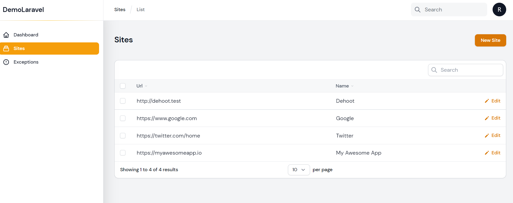
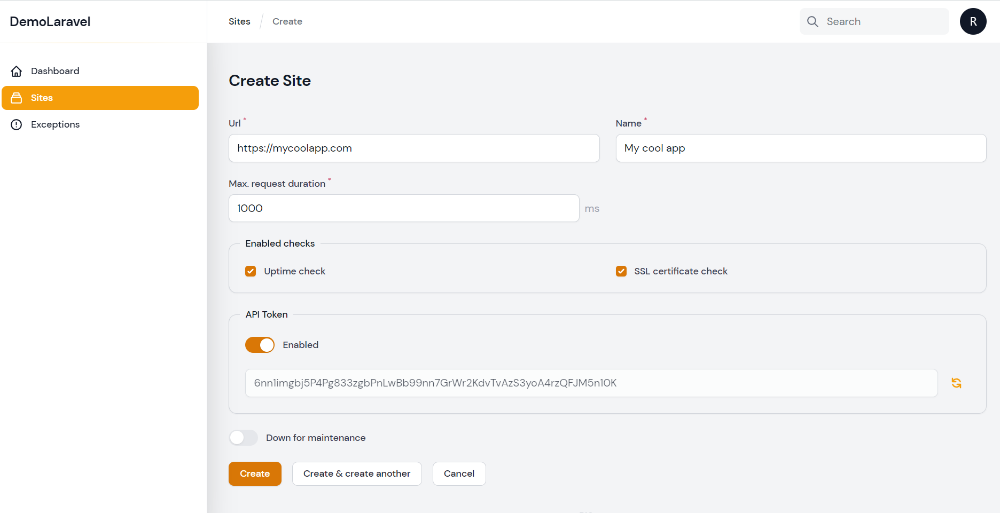
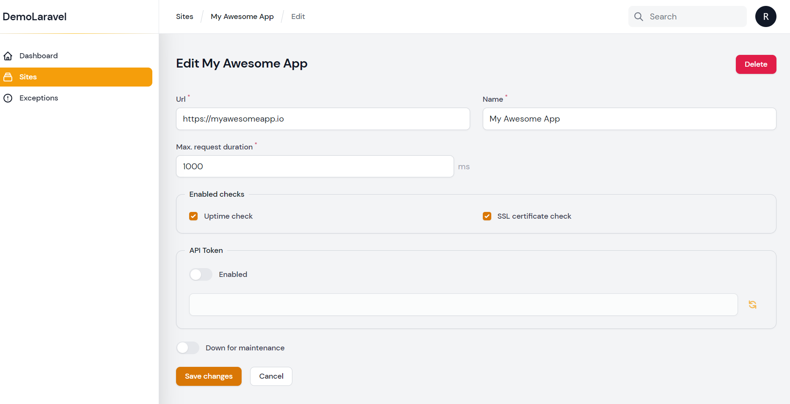
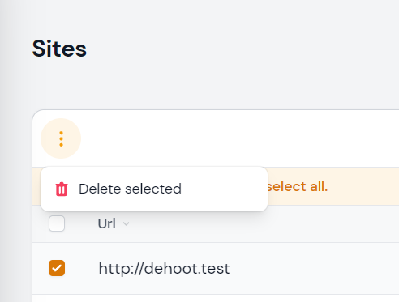

# Filament Resource

If you are setting up Moonguard for the first time, there are probably no records in the sites table, in order to create new sites you may press **Create a Site** on home dashboard or you may go to Site (sidebar), and press **New Site** button.

## List sites

Here you can **list**, **create**, **edit** or **delete** sites.

## Create a site

- **Url**: web address of you application - platform - site - service.
- **Name**: name to display.
- **Max. request duration**: maximum time for request in ms for **Uptime Check**.
- **Enabled checks**: services check for your site
  - **Uptime check**: service to check your site status.
  - **SSL Certificate check**: service to check your site SSL certificate.
- **API Token**: unique token to link your site using Larvis.
- **Down for maintenance**: bypass all your checks if your site is intentionally in maintenance.

## Edit a site

- **Url**: web address of you application - platform - site - service.
- **Name**: name to display.
- **Max. request duration**: maximum time for request in ms for **Uptime Check**.
- **Enabled checks**: services check for your site
  - **Uptime check**: service to check your site status.
  - **SSL Certificate check**: service to check your site SSL certificate.
- **API Token**: unique token to link your site using Larvis.
- **Down for maintenance**: bypass all your checks if your site is intentionally in maintenance.

## Delete a site

In site main view, you've to select (checkbox) the site you intend to delete, a popover menu will be available with the option to delete selected sites:

:::caution Heads Up
If you delete a site any data related to the site will be deleted aswell.
:::
