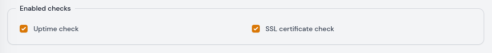
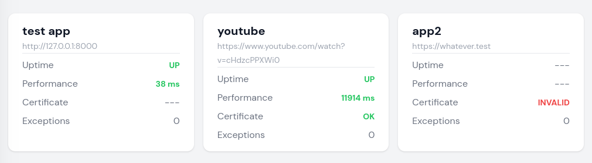

# SSL Certificate
MoonGuard is also capable of checking the status of SSL certificates for your
sites. This feature will notify you if a certificate is about to expire, is
invalid, or does not exist.

To check the SSL certificate for your site, navigate to the site's edit page
and enable the SSL certificate check button.



Then you can use the SSL Certificate command:

```bash
php artisan check:ssl-certificate
```

:::caution Heads Up
Please ensure that your site is not in maintenance mode, as this will prevent
the ssl-certificate check from monitoring its SSL certificate.
:::

The SSL certificate can be viewed in your dashboard.



Other behaviors of the SSL certificate can be disabled or modified in the configuration file.

```php
[
  'ssl_certificate_check' => [
    'enabled' => true,
    'model' => \Taecontrol\MoonGuard\Models\SslCertificateCheck::class,
    'notify_expiring_soon_if_certificate_expires_within_days' => 7,
    'cron_schedule' => '* * * * *',
  ],
]
```

:::caution Heads Up
If you have a site in maintenance mode and had previously done an
ssl-certificate check without this mode, the status card will show that
previous check.
:::
