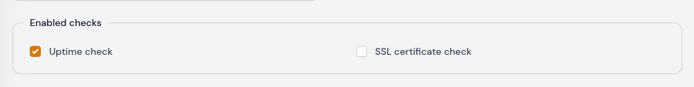
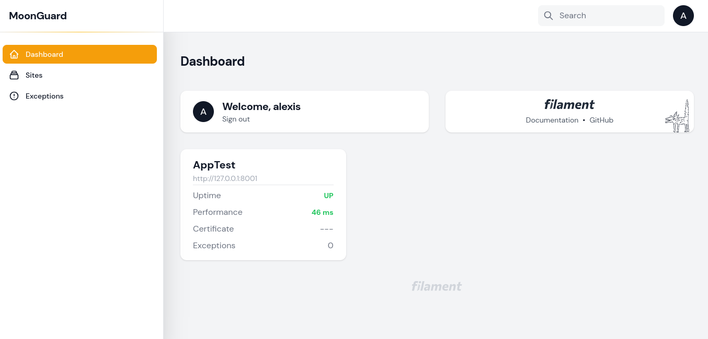
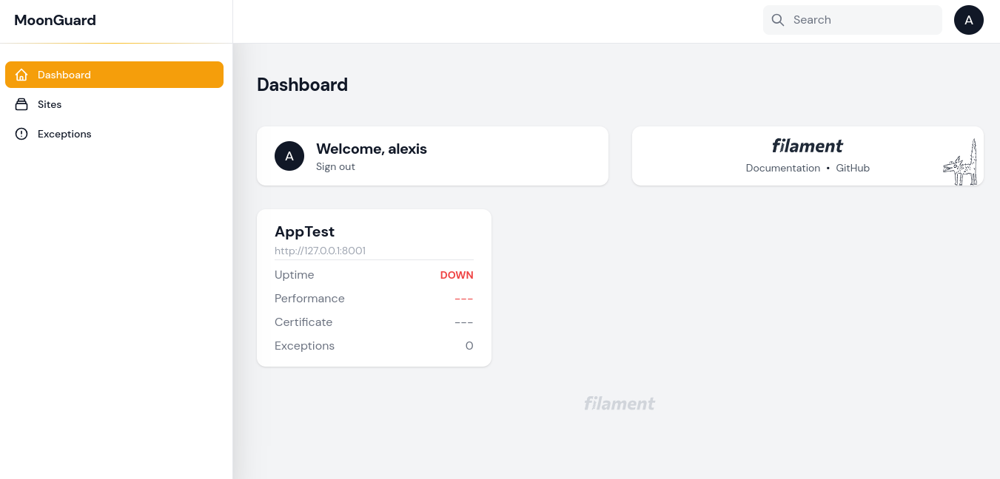

# Uptime

The uptime check feature allows users to determine whether their site is
currently online or not. If the site goes down, notifications can be sent via
email or Slack. For more details on notifications, please refer to the notification
section.

You can set up the Uptime check either when creating a new site or when editing
an existing one in the 'enable check' section.



:::caution Heads Up
Please ensure that your site is not in maintenance mode, as this will prevent
the Uptime check from monitoring its uptime.
:::

Afterwards, you can utilize the uptime check command to view the uptime
information in the Dashboard panel.

```bash
php artisan check:uptime
```



If the site is down, the command will return Down.



Users can also disable or modify other behaviors in the MoonGuard config file.

```php
[
  'uptime_check' => [
    'enabled' => true,
    'model' => \Taecontrol\MoonGuard\Models\UptimeCheck::class,
    'notify_failed_check_after_consecutive_failures' => 1,
    'resend_uptime_check_failed_notification_every_minutes' => 5,
  ],
]
```
:::caution Heads Up
If you have a site in maintenance mode and had previously done an uptime check
without this mode, the status card will show that previous uptime.
:::
