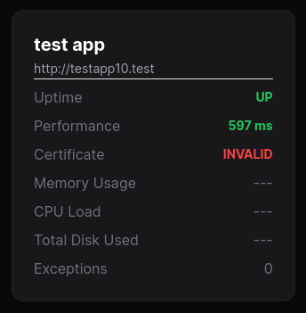

# Exceptions

MoonGuard allows users to review their site's exceptions using Larvis ,
a package designed to handle exceptions and send them to the MoonGuard plugin.
Before checking your site's exceptions, please ensure that Larvis has been
installed (refer to the
[Larvis documentation](https://github.com/taecontrol/larvis/tree/1.x)) and that
your **API Token** has been added to the .env file of your site project.


```php
MOONGUARD_DOMAIN=https://moonguard.com
MOONGUARD_SITE_API_TOKEN=UlRxbpzCEMvaDJmoHvnUvOgOugoT3aRprs9DtLn9fZpmr9aoKExMa71hTLO3
KRATER_DEBUG=false
```

After installing Larvis, the number of exceptions for a site can be viewed in
the status card on the dashboard.



Additionally, all exceptions can be found on the Exception view. On the Exception
view, users can view all exceptions in a group, including the first and last
reported times. To access and review the details of a specific exception, click on the corresponding exception row.


On this view, users can resolve, ignore, review, or mark exceptions as unresolved.


The behavior of the exception log can also be modified in the MoonGuard config file.

```php
<?php
[
  'exceptions' => [
    /*
     * Enable or disable exception logging globally.
     */
    'enabled' => true,

    /*
     * The number of minutes that should be waited before sending a notification about exception log group updates.
     */
    'notify_time_between_group_updates_in_minutes' => 15,

    'exception_log' => [
      /*
       * The exception log model to use.
       */
      'model' => \Taecontrol\MoonGuard\Models\ExceptionLog::class,
    ],

    'exception_log_group' => [
      /*
       * The exception log group model to use.
       */
      'model' => \Taecontrol\MoonGuard\Models\ExceptionLogGroup::class,
    ],
  ],
]
```
