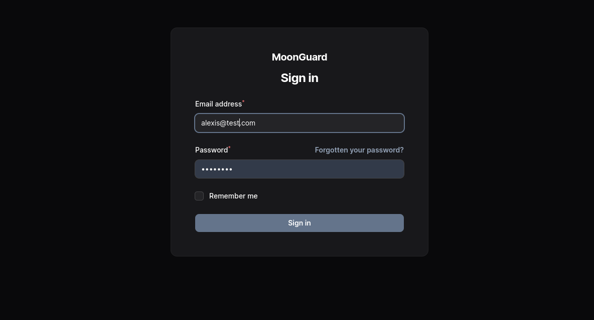
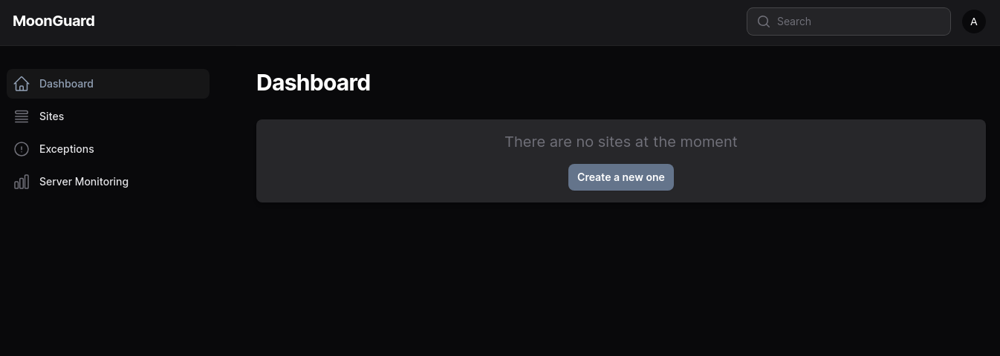

# Installation

## Requirements

Before using MoonGuard, make sure you have the following installed:

- Laravel Framework 10+
- Filament 3.0+
- Composer
- Node.js (Version 18+)

Filament is necessary to use MoonGuard in your project, you can install Filament
by following the official documentation [here](https://filamentphp.com/docs/3.x/panels/installation).


Once you setup your Laravel project with filament, you can install MoonGuard
plugin via composer

```bash
composer require taecontrol/moonguard
```

Publish the MoonGuard assets files and migrations file in your project.

:::caution Heads Up
If you have already published Moonguard Migrations before its release, please
refer to the migration [documentation](./migrations) for any updates.
:::

```bash
php artisan vendor:publish --tag="moonguard-assets"

php artisan vendor:publish --tag="moonguard-migrations"
```

In production, run the migrations:

```bash
php artisan migrate
```

Go to `/moonguard` route to check the MoonGuard admin panel page:



If you don’t have any user, you can create a filament user to access to MoonGuard
admin panel:

```bash
php artisan make:filament-user
```

 Login and you will land in the dashboard



## Moonguard Command Scheduler

The **MoonGuard Command Scheduler** is a helper utility that executes all the
Moonguard commands related to checks:

- CheckUptimeCommand.
- CheckSslCertificateCommand.
- DeleteOldExceptionCommand.
- DeleteSystemMetricCommand.

You can use this utility to set up MoonGuard task scheduling faster.

In order to use this utility, define a new schedule in your app and inside the
`schedule` method of **`app/Console/Kernel.php`** . Use the static function
`scheduleMoonGuardCommands()` from the **MCS** class, then pass the `$schedule`
object and three cron strings (one for the Uptime Check, one for the SSL
Certificate Check and one for delete old Exceptions that is optional):

```php
<?php

use Taecontrol\MoonGuard\Console\MoonGuardCommandsScheduler;
//...

protected function schedule(Schedule $schedule): void
{
  MoonGuardCommandsScheduler::scheduleMoonGuardCommands(
    $schedule,
    '* * * * *', // <-- Uptime Check Cron
    '* * * * *', //<-- SSL Certificate Cron
    '* * * * *', //<-- [Optional] Delete Exceptions Cron
    '* * * * *' //<-- [Optional] Delete System metrics
  );
}
```

The MoonGuardCommandsScheduler is scheduled by running `php artisan schedule:run`.
In case you want to setup individually each command  you can do it as following:

## Scheduling CheckUptime Command

Scheduling the Uptime Check can be done through the `CheckUptimeCommand` class
and Laravel's command scheduler.

Go to **`app/Console/Kernel.php`** and use the `CheckUptimeCommand` class and
add schedule dthe command in the `schedule()` method:

```php
<?php

namespace App\Console;

use Illuminate\Console\Scheduling\Schedule;
use Illuminate\Foundation\Console\Kernel as ConsoleKernel;
use Taecontrol\MoonGuard\Console\Commands\CheckUptimeCommand;

class Kernel extends ConsoleKernel
{
  //...
   /**
   * Define the application's command schedule.
   *
   * @param  \Illuminate\Console\Scheduling\Schedule  $schedule
   * @return void
   */
  protected function schedule(Schedule $schedule)
  {
    $schedule->command(CheckUptimeCommand::class)->everyMinute();
  }
}
```

With this, all your sites uptime status will be updated every minute.

## Scheduling CheckSslCertificate Command

The CheckSslCertificateCommand can also be scheduled using Laravel's command Scheduler
and specify when the command should run in the schedule method.

```php
<?php

namespace App\Console;

use Illuminate\Console\Scheduling\Schedule;
use Illuminate\Foundation\Console\Kernel as ConsoleKernel;
use Taecontrol\MoonGuard\Console\Commands\CheckSslCertificateCommand;

class Kernel extends ConsoleKernel
{
    /**
   * Define the application's command schedule.
   *
   * @param  \Illuminate\Console\Scheduling\Schedule  $schedule
   * @return void
   */
  protected function schedule(Schedule $schedule)
  {
      $schedule->command(CheckSslCertificateCommand::class)->everyTwoHours();
  }
}
```

In this case, we can set the **`CheckSslCertificateCommand`** to run every
2 hours.

## Scheduling DeleteOldException Command

The DeleteOldExceptionCommand deletes all exceptions that are older than 7 days
by default. You can change its behavior in the configuration file.

```php
<?php

namespace App\Console;

use Illuminate\Console\Scheduling\Schedule;
use Illuminate\Foundation\Console\Kernel as ConsoleKernel;
use Taecontrol\MoonGuard\Console\Commands\DeleteOldExceptionCommand;

class Kernel extends ConsoleKernel
{
    /**
   * Define the application's command schedule.
   *
   * @param  \Illuminate\Console\Scheduling\Schedule  $schedule
   * @return void
   */
  protected function schedule(Schedule $schedule)
  {
      $schedule->command(DeleteOldExceptionCommand::class)->daily();
  }
}
```

## Scheduling DeleteSystemMetricCommand

The DeleteSystemMetricCommand deletes all the Systems Monitoring data older than
7 days by default. You can change its behavior in the configuration file.

```php
<?php

namespace App\Console;

use Illuminate\Console\Scheduling\Schedule;
use Illuminate\Foundation\Console\Kernel as ConsoleKernel;
use Taecontrol\MoonGuard\Console\Commands\DeleteSystemMetricCommand;

class Kernel extends ConsoleKernel
{
    /**
   * Define the application's command schedule.
   *
   * @param  \Illuminate\Console\Scheduling\Schedule  $schedule
   * @return void
   */
  protected function schedule(Schedule $schedule)
  {
      $schedule->command(DeleteSystemMetricCommand::class)->daily();
  }
}
```

For more scheduling options, please refer to the [Laravel documentation](https://laravel.com/docs/10.x/scheduling#schedule-frequency-options).
